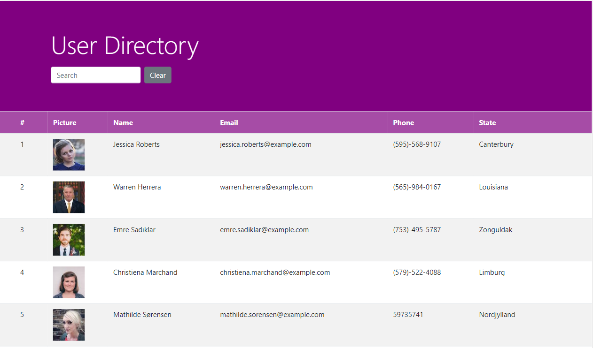

# User-Directory

# Deployed link:-
(https://bettycode.github.io/User-Directory/)

# Description

#

#

# Table of Contents

* [Installation](#installation)

* [Usage](#usage)

* [License](#license)

* [Contributing](#contributing)

* [Tests](#tests)

* [Questions](#questions)

# Installation

Dependencies must be installed to run the application properly:

# Usage

# License

This project is license under the **MIT** license.

# Contributing

* Contributor: Bethlehem Balcha

# Tests

To run tests, you need to run the following command:

# Questions

* If you have any questions:-

* GitHub username: @bettycode

* Email: betty.haile.us@gmail.com

